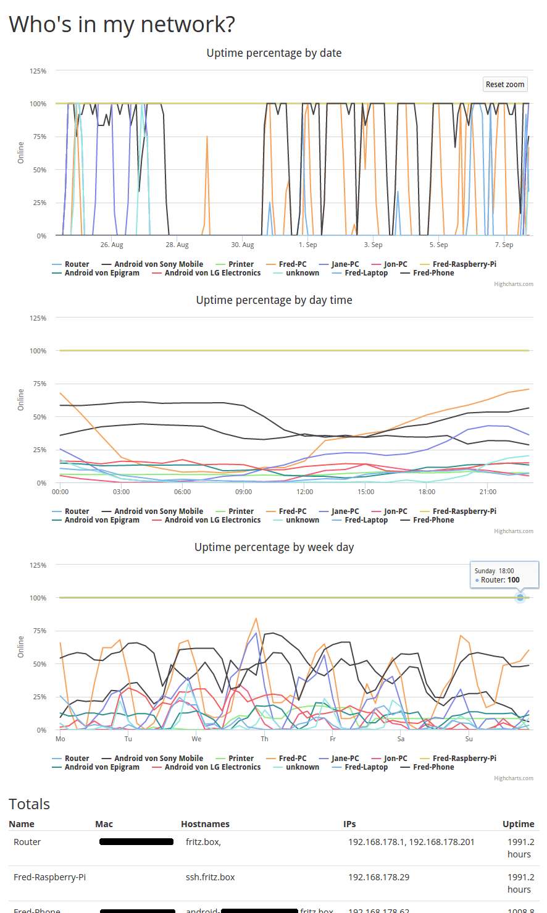

# nmap-log-parse

Logs which devices are in your local network and draws graphs

Screenshot:



## Setup

1. add this line to your crontab on your raspberry pi (or other device that is always on):

    `*/10 * * * * nmap -sn $subnet -oX - >> $outputpath/logs`
    
    or 
    
    `*/10 * * * * nmap -sn $subnet -oX - | xz >> $outputpath/logs.xz`
    
    if you don't have a lot of space on that device.
    
    - $subnet is your local network, e.g. '192.168.178.*'
    - $outputpath is the path where you want your log stored

2. create a `config.json` file in the same folder as the `index.html` is in. For the schema see [Configuration.ts](src/Configuration.ts)

    minimal example for a working `config.json`:
    ```json
    {
    	"input": "../logs",
    	"macToName": {},
    	"hostToName": {},
    	"logInterval": 10,
    	"ignoreLessThan": 3000,
    	"self": "raspberry-hostname"
    }
    ```

    If you want, you can add some readable hostnames to `macToName` or `hostToName` like this:

    ```json
    "macToName": {
    	"AB:CD:EF:01:23": "John's PC"
    }
    ```

3. Open `index.html` in a browser. Firefox should directly work, for Chrome you need to open it via a server (like `python3 -m http.server`) because of security reasons.
